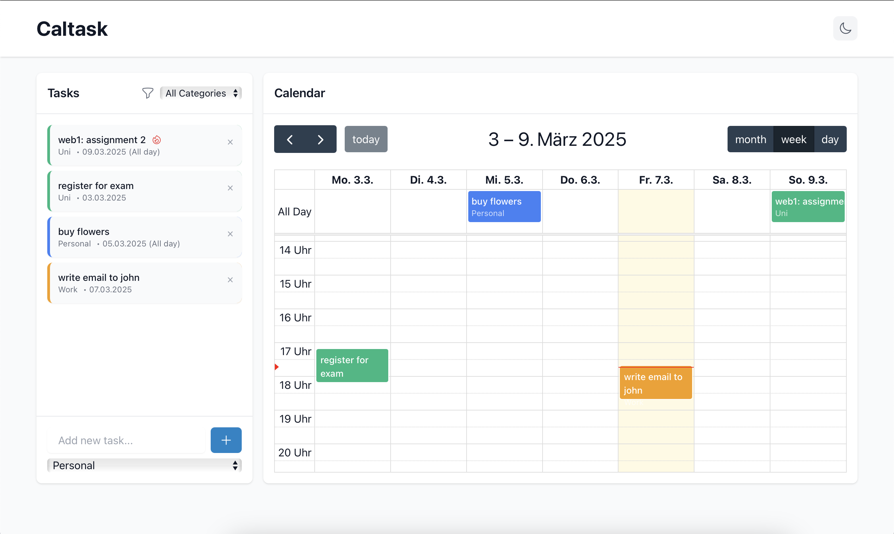

# Caltask - Task & Calendar Management Web Application



Caltask is a modern web application that helps users manage their tasks and schedule them efficiently using a calendar interface. The application features drag-and-drop functionality, integration with external calendars, and persistent backend storage.

## Features

- Task Management with categories and colors
- Drag-and-Drop scheduling
- Weekly calendar view with hourly scheduling
- Persistent backend storage [tbd]
- Google Calendar integration (coming soon)
- Responsive design
- Dark mode support

## Tech Stack

- Frontend: React with TypeScript
- UI Framework: Tailwind CSS
- Calendar Component: FullCalendar
- Backend: Node.js with Express and TypeScript
- Database: PostgreSQL
- ORM: Prisma
- Authentication: NextAuth.js

## Prerequisites

- Node.js (v18 or higher)
- PostgreSQL
- npm or yarn

## Getting Started

1. Clone the repository:
```bash
git clone https://github.com/malloc37/caltask.git
cd caltask
```

2. Install dependencies:
```bash
npm install
```

3. Set up environment variables:
```bash
cp .env.example .env
# Edit .env with your configuration
```

4. Set up the database:
```bash
npx prisma migrate dev
```

5. Start the development server:
```bash
npm run dev
```

The application will be available at `http://localhost:3000`

## Project Structure

```
caltask/
├── client/                 # Frontend React application
│   ├── src/
│   │   ├── components/    # React components
│   │   ├── pages/        # Page components
│   │   ├── hooks/        # Custom React hooks
│   │   ├── types/        # TypeScript type definitions
│   │   └── utils/        # Utility functions
│   └── public/           # Static assets
├── server/               # Backend Node.js application
│   ├── src/
│   │   ├── controllers/ # Route controllers
│   │   ├── models/      # Database models
│   │   ├── routes/      # API routes
│   │   └── utils/       # Utility functions
│   └── prisma/         # Database schema and migrations
└── package.json
```

## Contributing

1. Fork the repository
2. Create your feature branch (`git checkout -b feature/amazing-feature`)
3. Commit your changes (`git commit -m 'Add some amazing feature'`)
4. Push to the branch (`git push origin feature/amazing-feature`)
5. Open a Pull Request

## License

This project is licensed under the MIT License - see the LICENSE file for details. 